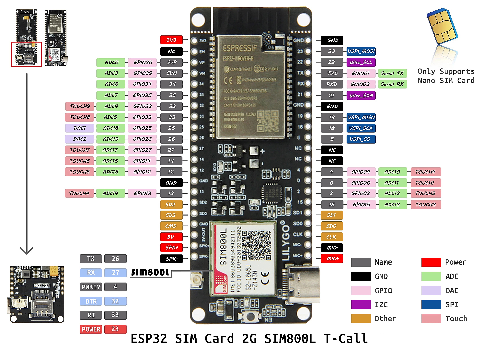
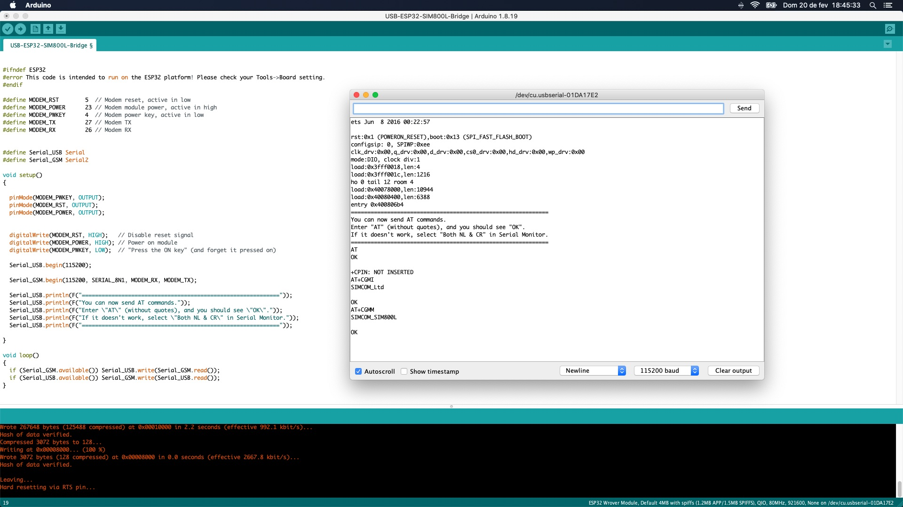

# USB-ESP32-SIM800L-Bridge
Small piece of code to make the ESP32 act as a bridge between the USB interface and the SIM800L GPRS/GSM module. For debugging purposes.

## Description
This code makes the ESP32 microcontroller act as a simple bridge between the usb port and the SIM800L GPRS/GSM modem when they are mounted on the same module. It is intended for debugging purposes or test AT commands for example. It was designed for the module below:

The SIM800L is a GPRS/GSM modem, so it depends on 2G network. Before purchasing one of these, make sure that in your region there is a telephony company providing a 2G network. You will also need a sim card for that company.

## How to use it
First, make sure that you have the ESP32 board in your Arduino IDE. If you don't, install it:

- Menu Arduino -> Preferences...
- In Additional Boards Manager URLs:, add: https://dl.espressif.com/dl/package_esp32_index.json
- Menu Tools -> Board -> choose ESP32 Arduino -> ESP32 Wrover Module
- Menu Tools -> Upload Speed -> 92100
- Menu Tools -> Flash Frequency: 80MHz
- Menu Tools -> Flash Mode: QIO
- Menu Tools -> Partition Scheme: Default 4MB with spifs
- Menu Tools -> Core Debug Level: none
- Menu Tools -> Port: \<your usb port connected to the module\>

Once you have uploaded the sketch to the module, it will restart and you can open the Serial Monitor for testing.

Some AT commands for testing:

- **AT** returns OK
- **AT+CGMI** returns the modem's manufacturer identifier (SIMCOM_Ltd, surely)
- **AT+CGMM** returns the modem's model (SIMCOM_SIM800L, probably)
